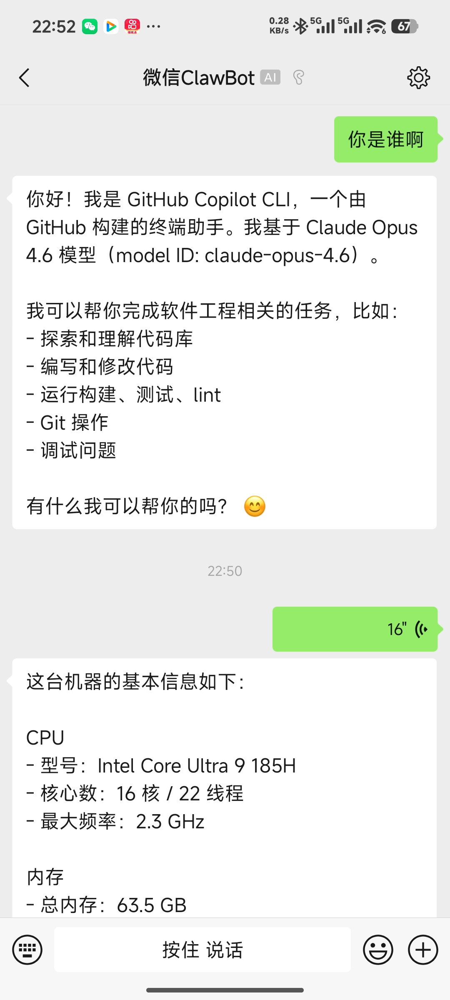

# WeChat ACP

[](https://www.npmjs.com/package/wechat-acp)

Bridge WeChat direct messages to any ACP-compatible AI agent.

`wechat-acp` logs in with the WeChat iLink bot API, polls incoming 1:1 messages, forwards them to an ACP agent over stdio, and sends the agent reply back to WeChat.



## Features

- WeChat QR login with terminal QR rendering
- One ACP agent session per WeChat user
- Built-in ACP agent presets for common CLIs
- Custom raw agent command support
- Auto-allow permission requests from the agent
- Direct message only; group chats are ignored
- Background daemon mode

## Requirements

- Node.js 20+
- A WeChat environment that can use the iLink bot API
- An ACP-compatible agent available locally or through `npx`

## Quick Start

Start with a built-in agent preset:

```bash
npx wechat-acp --agent copilot
```

Or use a raw custom command:

```bash
npx wechat-acp --agent "npx my-agent --acp"
```

On first run, the bridge will:

1. Start WeChat QR login
2. Render a QR code in the terminal
3. Save the login token under `~/.wechat-acp`
4. Begin polling direct messages

## Built-in Agent Presets

List the bundled presets:

```bash
npx wechat-acp agents
```

Current presets:

- `copilot`
- `claude`
- `gemini`
- `qwen`
- `codex`
- `opencode`

These presets resolve to concrete `command + args` pairs internally, so users do not need to type long `npx ...` commands.

## CLI Usage

```text
wechat-acp --agent <preset|command> [options]
wechat-acp agents
wechat-acp stop
wechat-acp status
```

Options:

- `--agent <value>`: built-in preset name or raw agent command
- `--cwd <dir>`: working directory for the agent process
- `--login`: force QR re-login and replace the saved token
- `--daemon`: run in background after startup
- `--config <file>`: load JSON config file
- `--instance <name>`: run as a named, isolated instance. See "Running multiple instances" below.
- `--idle-timeout <minutes>`: session idle timeout, default `1440` (use `0` for unlimited)
- `--max-sessions <count>`: maximum concurrent user sessions, default `10`
- `--hide-thoughts`: do not forward agent thinking to WeChat (default: forwarded)
- `-h, --help`: show help

Examples:

```bash
npx wechat-acp --agent copilot
npx wechat-acp --agent claude --cwd D:\code\project
npx wechat-acp --agent "npx @github/copilot --acp"
npx wechat-acp --agent gemini --daemon
```

## Running multiple instances

By default everything (saved login token, daemon pid/log, sync state, telemetry id) lives under `~/.wechat-acp/`, which means a single machine can only host one bridge at a time. Pass `--instance <name>` to namespace all of that under `~/.wechat-acp/instances/<name>/` and run several bridges side by side, each with its own WeChat account and project directory.

Typical setup: WeChat account 1 drives project A, WeChat account 2 drives project B.

```bash
# Terminal 1: scan with WeChat account 1
npx wechat-acp --instance projA --agent copilot --cwd D:\code\repo-a

# Terminal 2: scan with WeChat account 2
npx wechat-acp --instance projB --agent copilot --cwd D:\code\repo-b
```

The first run of each instance prints its own QR code. Tokens are saved per instance, so subsequent runs reuse them independently.

The `stop` and `status` subcommands also honor `--instance`:

```bash
npx wechat-acp status --instance projA
npx wechat-acp stop   --instance projB
```

Without `--instance`, paths fall back to `~/.wechat-acp/` exactly as before, so existing installs are unaffected.

## Configuration File

You can provide a JSON config file with `--config`.

Example:

```json
{
  "agent": {
    "preset": "copilot",
    "cwd": "D:/code/project"
  },
  "session": {
    "idleTimeoutMs": 86400000,
    "maxConcurrentUsers": 10
  }
}
```

You can also override or add agent presets:

```json
{
  "agent": {
    "preset": "my-agent"
  },
  "agents": {
    "my-agent": {
      "label": "My Agent",
      "description": "Internal team agent",
      "command": "npx",
      "args": ["my-agent-cli", "--acp"]
    }
  }
}
```

## Runtime Behavior

- Each WeChat user gets a dedicated ACP session and subprocess.
- Messages are processed serially per user.
- Replies are formatted for WeChat before sending.
- Typing indicators are sent when supported by the WeChat API.
- Sessions are cleaned up after inactivity (set `idleTimeoutMs` to `0` to disable idle cleanup).

## Storage

By default, runtime files are stored under:

```text
~/.wechat-acp
```

This directory is used for:

- saved login token
- daemon pid file
- daemon log file
- sync state
- anonymous telemetry install id (`telemetry-id`, see Telemetry section)

When `--instance <name>` is used, the same files live under `~/.wechat-acp/instances/<name>/` instead, fully isolated from other instances.

## Current Limitations

- Direct messages only; group chats are ignored
- MCP servers are not used
- Permission requests are auto-approved
- Agent communication is subprocess-only over stdio
- Some preset agents may require separate authentication before they can respond successfully

## Development

For local development:

```bash
npm install
npm run build
```

Run the built CLI locally:

```bash
node dist/bin/wechat-acp.js --help
```

Watch mode:

```bash
npm run dev
```

## Telemetry

`wechat-acp` collects anonymous usage telemetry via Azure Application Insights to help understand which agent presets are used and to detect crashes.

**To disable telemetry**, set the `WECHAT_ACP_TELEMETRY` environment variable to `0`, `false`, or `off` before running:

```bash
WECHAT_ACP_TELEMETRY=0 npx wechat-acp --agent copilot
```

**What is collected** (9 event types only):

- `app.start` / `app.stop` — process lifecycle, agent preset name, daemon flag, uptime
- `login.success` / `login.failure` / `token.reused` — WeChat login outcomes (no token, no QR URL)
- `message.received` — message arrived; only the categorical kind (`text` / `image` / `voice` / `file` / `video` / `empty`) and a hashed user id
- `session.created` — new ACP session opened
- `prompt.completed` — ACP turn finished; agent preset, stop reason, duration, reply length
- `reply.sent` — reply pushed back to WeChat; segment count, total length

Plus exception reports for `monitor`, `prompt`, `reply`, `auth`, `agent_spawn`, and `enqueue` failures.

**What is never collected**: message bodies, filenames, voice transcripts, image URLs, login tokens, QR codes, raw agent command strings, environment variables, working directory paths, raw WeChat user IDs.

User IDs are sha256-hashed with a per-install salt stored in `~/.wechat-acp/telemetry-id`. The salt is generated on first run and never leaves your machine. Delete the file to rotate it.

## License

MIT